#  LexiGrow

An iOS app designed to help people learn English.  

**Features**  
- practice with flashcards to reinforce memory.  
- track the number of words you’ve learned.

**iOS 18.6+**  

---

## Screenshots
<p align="center">
   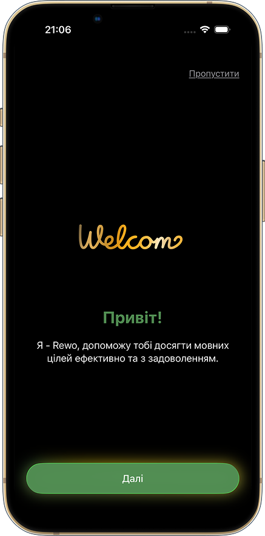
   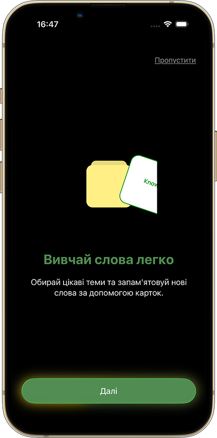
   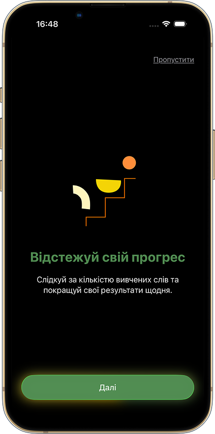
   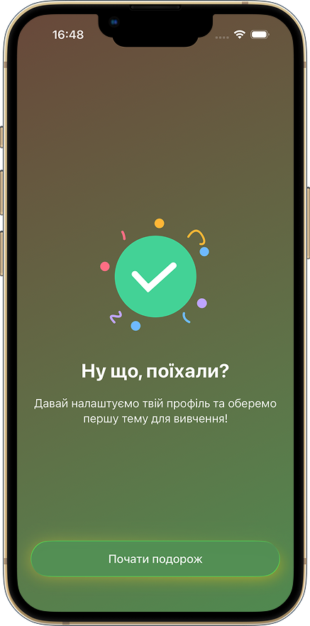
   
   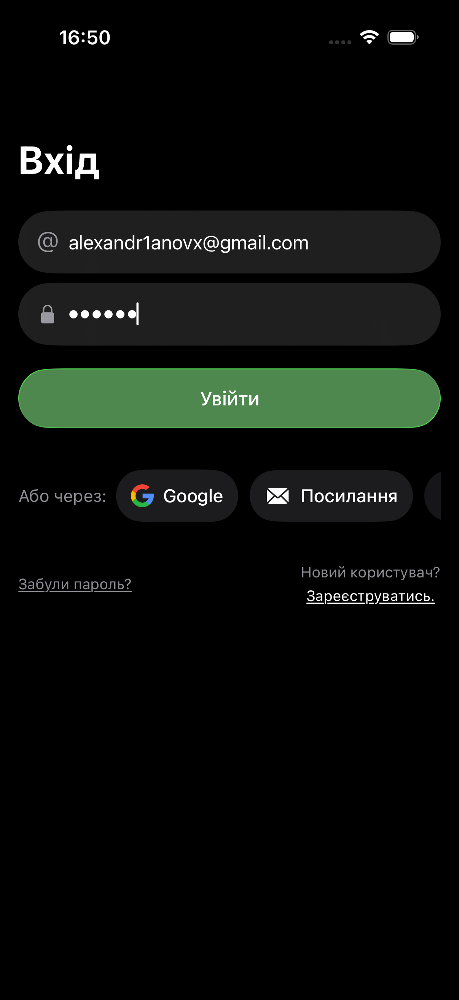
   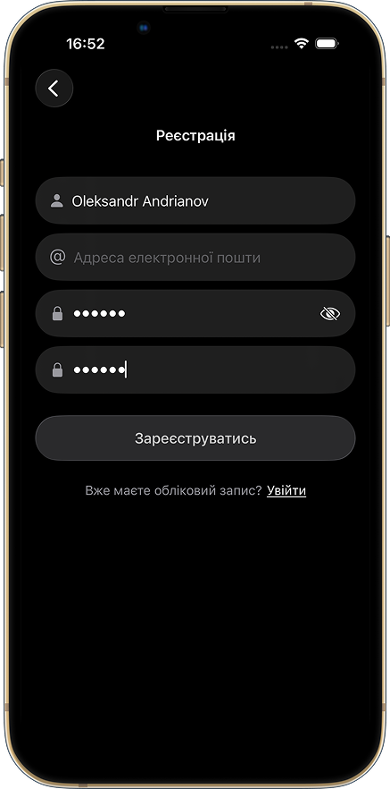
   
   
   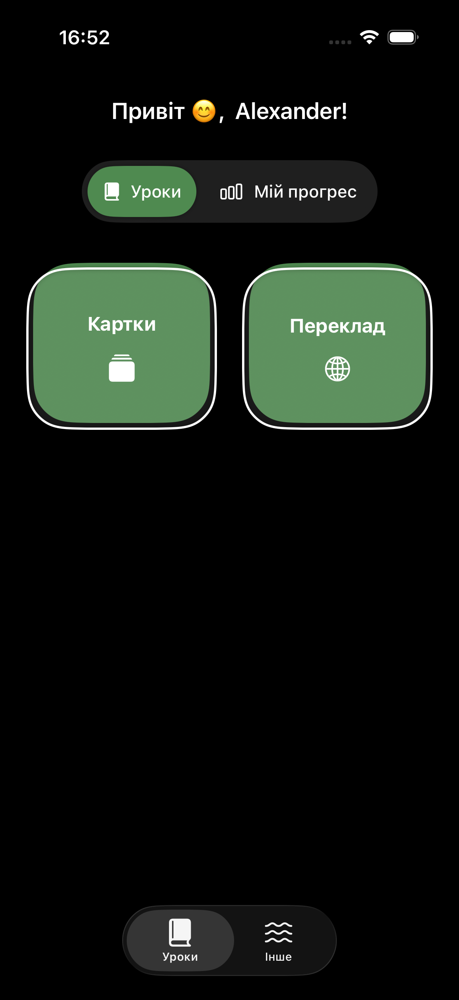
   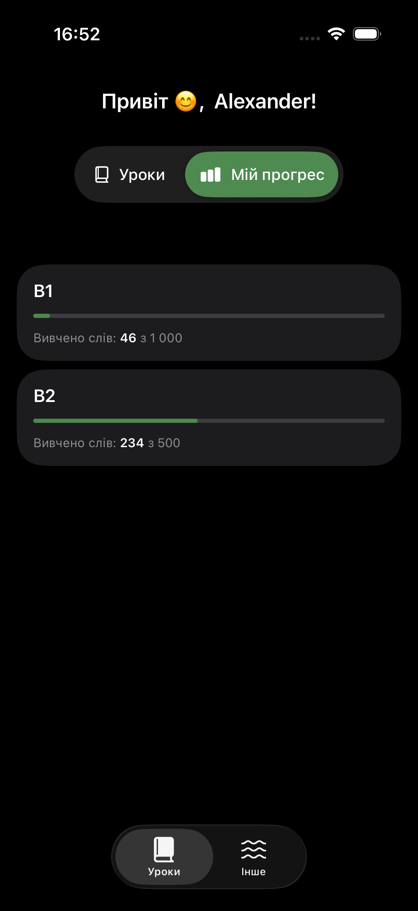
   
   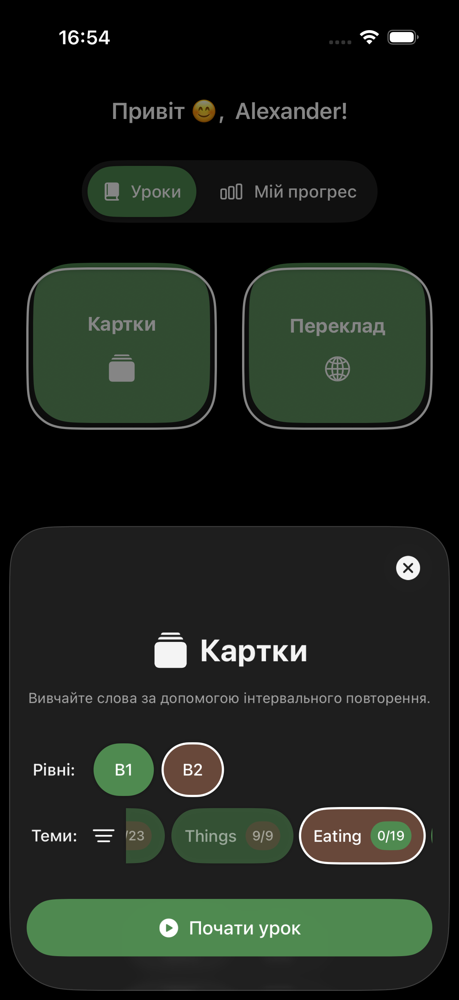
   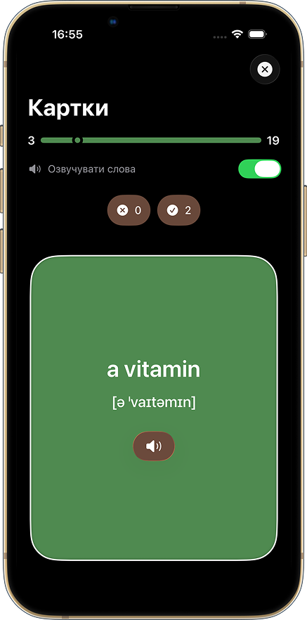
   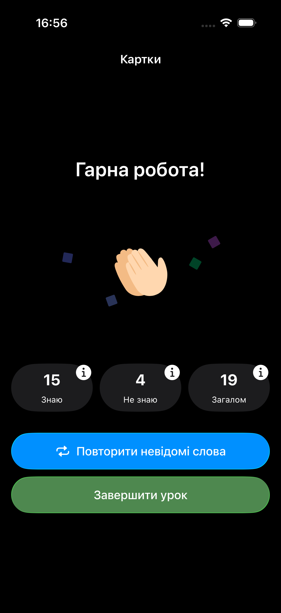

   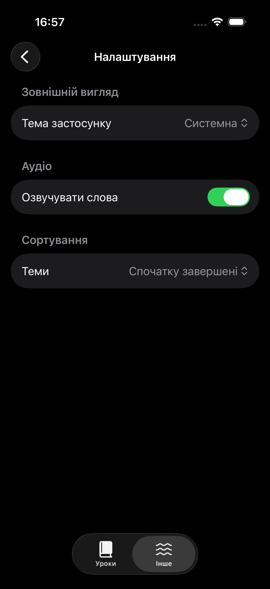
   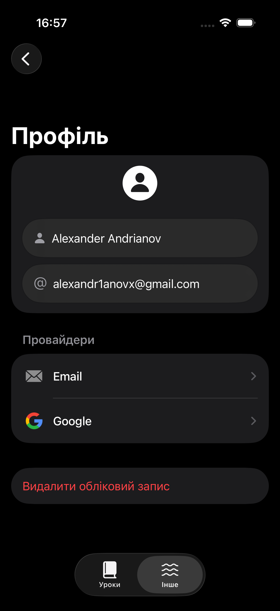
</p>

---

## Tech Stack  
- MVVM
- SwiftUI
- SwiftData
- Supabase
- AVFoundation
- async/await
---

## Installation  

   ```bash
   git clone https://github.com/alexandr1anovx/LexiGrow.git
