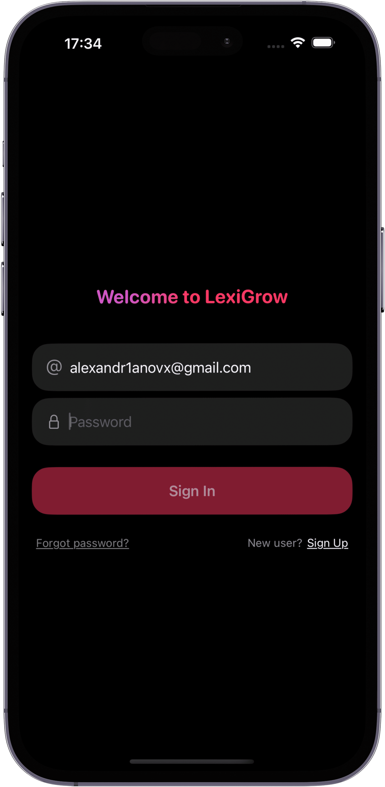
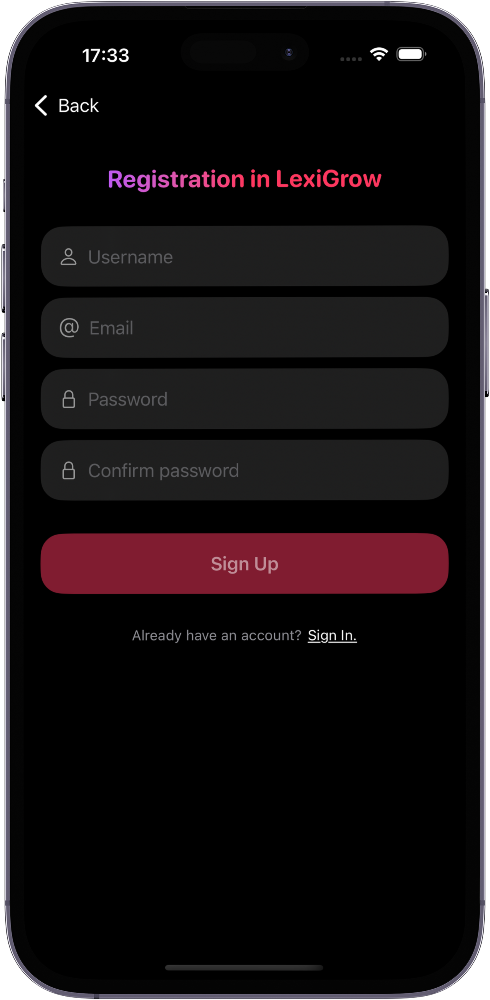
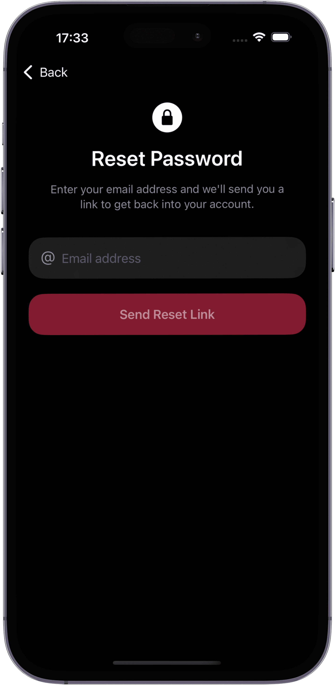
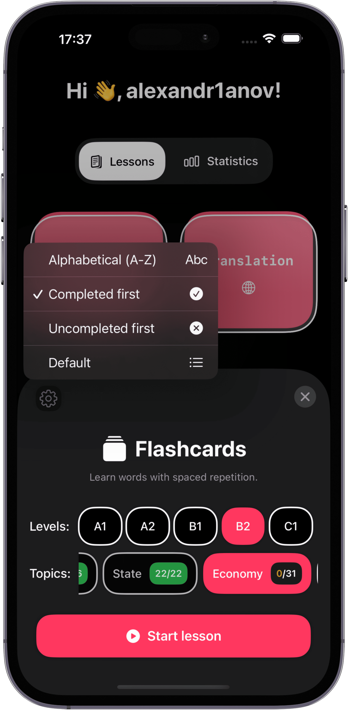
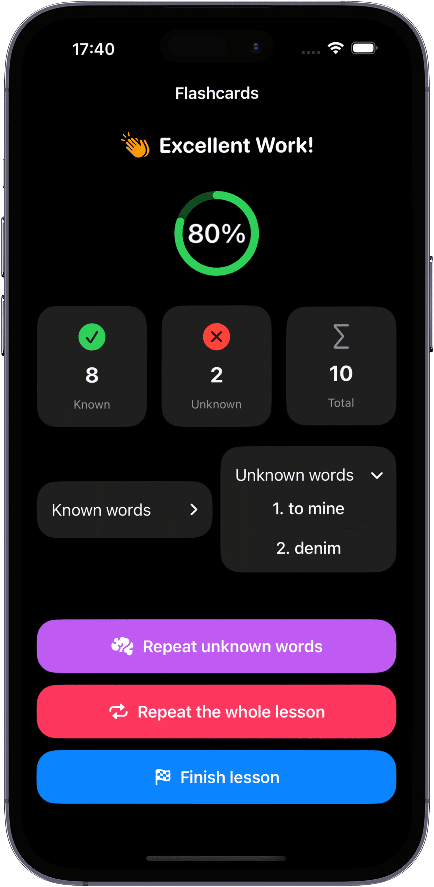
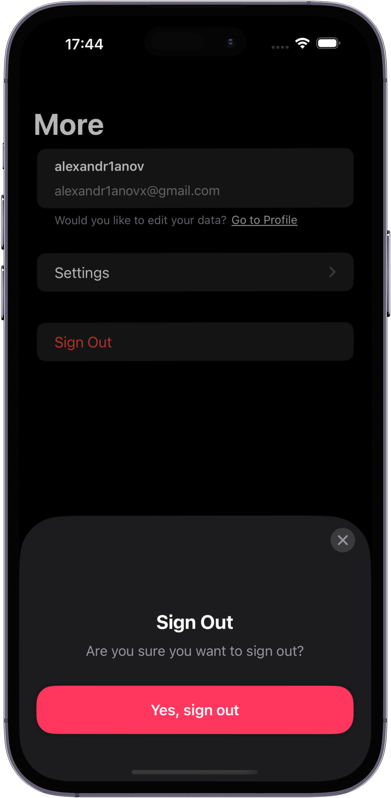

#  LexiGrow

An iOS app designed to help people learn English.  

**features**:  
- practice with flashcards to reinforce memory.  
- track the number of words you’ve learned.

**iOS 18+**  

---

## screenshots:
<p align="center">
   
   
   
   
   
   
   
   
   
</p>

---

## tech stack:  
- SwiftUI, MVVM, Supabase, AVFoundation, async/await.

---

## installation:  

   ```bash
   git clone https://github.com/alexandr1anov/LexiGrow.git
